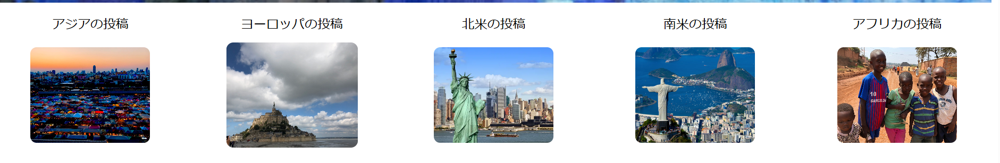
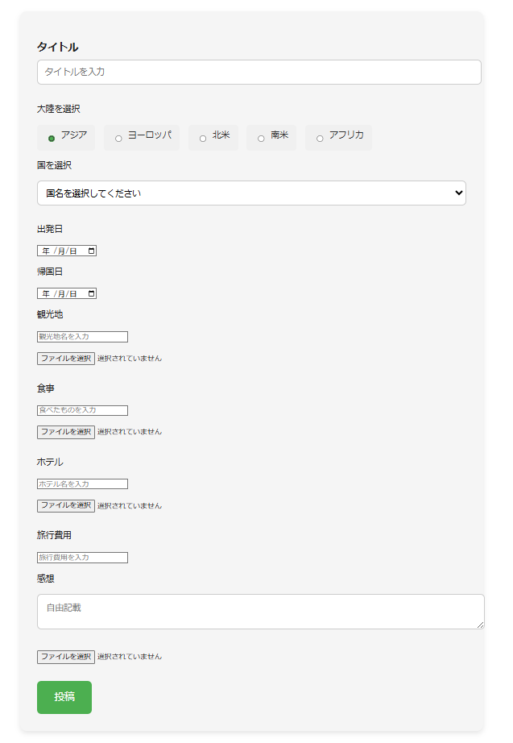
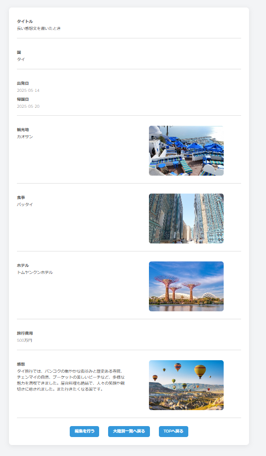
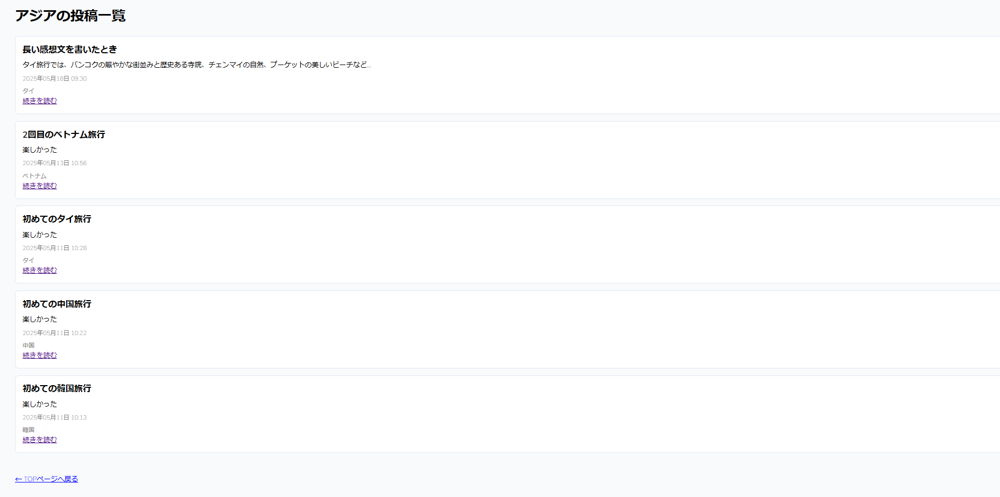
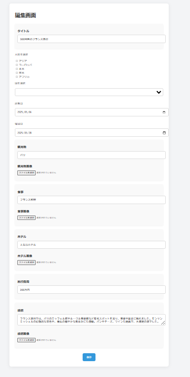

# 🚀 旅行ログアプリケーション

## 概要

**旅行ログアプリケーション** は、自身の旅をした経験を投稿できるアプリケーションです。ポートフォリオとして、モダンなWebアプリ開発技術や設計力をアピールする目的で作成しました。

---

## 📷 デモ

準備中（URLができたらここに貼る予定）

---

## 🔧 使用技術

- **フロントエンド**: React + TypeScript + Tailwind CSS
- **バックエンド**:  laravel (PHP)
- **データベース**: MySQL
- **CI/CD**: ーー
- **その他**: Docker / Prettier / ESLint

---

## 🧩 主な機能

- ログ投稿機能

---

## 🗃️ データベース設計

### 📄 `users` テーブル

| フィールド名        | 型       | 説明                           |
|---------------------|----------|--------------------------------|
| id                  | int   | ユーザID                         |
| name         | string   | ユーザ名                           |

### 📄 `continents` テーブル

| フィールド名        | 型       | 説明                           |
|---------------------|----------|--------------------------------|
| id                  | int   | 大陸ID                         |
| name         | string   | 大陸名                         |

### 📄 `countries` テーブル

| フィールド名        | 型       | 説明                           |
|---------------------|----------|--------------------------------|
| id                  | int   | 国ID                         |
| name         | string   | 国名 (例｜タイ)                     |   
| continent_id         | int   | 大陸ID (例｜3)                     |     

### 📄 `logs` テーブル

| フィールド名        | 型       | 説明                           |
|---------------------|----------|--------------------------------|
| id                  | int   | ログID                         |
| title                  | int   | タイトル                         |
|  tourist_spot        | string   | 観光地名 (例｜アンコールワット)                        |
|  food        | string   | 食事名 (例｜カオマンガイ)                        |
|  hotel        | string   | 宿泊場所 (例｜◯◯ホテル)                        |
|  money        | string   | 旅行費用 (例｜4000THB)                        |
|  impressions        | string   | 感想 (例｜たのしかったです)                        |
|  user_id        | int   | usersテーブルのid (例｜10)                        |
|  countory_id        | int   | 国テーブルのid (例｜10)                        |
|  start_date        | date   | 出発日 (例｜2025/04/08)                        |
|  end_date        | date   | 帰国日 (例｜2025/04/12)                        |
|  tourist_spot_photo        | string   | 観光地画像 (例｜https://googledrive/xxx/xxx.png)                        |
|  food_photo        | string   | 食事画像 (例｜https://googledrive/xxx/xxx.png)                        |
|  hotel_photo        | string   | 宿泊画像 (例｜https://googledrive/xxx/xxx.png)                        |
|  impressions_photo        | string   | 感想画像 (例｜https://googledrive/xxx/xxx.png)                        |
|  created_at        | date   | 作成日                       |
|  updated_at        | date   | 更新日                       |

---

## 🖥️ 画面設計（モック）

### 🔹 トップページ

- タイトル
- 過去の投稿検索フォーム（国名のプルダウン方式で表示）
- 背景は各国の風景などをスライド方式で表示

- 大陸別に過去の投稿一覧に飛べる大陸別リンクを表示

- 投稿フォームを表示
- タイトルを入力
- 大陸をラジオボタンで選択
- 国名をプルダウンで選択（ラジオボタンで選択した大陸により、大陸ごとに国名が絞られる）
- 出発日、帰国日を入力
- 観光地名を入力
- 観光地画像を添付
- 食べ物を入力
- 食事画像を添付
- 宿泊したホテルを入力
- ホテルの画像を添付
- 旅行費用を入力
- 感想を入力
- 旅行の画像を添付
- 投稿

### 🔹 投稿ページ

- 投稿フォームで投稿した内容を表示
- 編集ページリンクを表示
- 大陸別一覧ページリンクを表示
- TOPページへ戻るリンクを表示

### 🔹 大陸別投稿一覧ページ

- 投稿フォームで投稿した内容を大陸別で表示
- 新しい投稿を上から表示
- 投稿タイトルを表示
- 感想文を100文字まで表示
- 投稿日時を表示
- 国名を表示
- 投稿ページのリンクを表示

### 🔹 投稿編集ページ

- 投稿フォームで投稿した内容を編集
- テキスト、出発、帰国日は、投稿内容をそのまま表示
- 大陸、国名は再度選択
- 画像は再度添付
- 保存ボタンを表示

